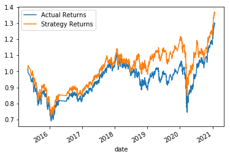

# module_14_challenge
Challenge assignment for module 14

# Original Algorithm Analysis

### Graph of Returns

Analyzing this graph, this algorithm did not provide any different returns until around 2018, where the algorithm's returns began to overtake the actual.  It is a decent algorithm, since it provides greater returns than simply holding the stock.

# Tuning the Baseline

Adjusting the size of training dataset:

### Decreasing the size

Decreasing the size of the dataset provided increased returns for the beginning of the dataset and greater returns towards the end of the dataset.

### Increasing the size

Increasing the size of the dataset gave equally sized returns to the baseline up to a certain point, but it began to return much less than the baseline in 2020, possibly due to high volatility.

Assumption: Decreasing the size of the dataset could be beneficial to a point, to avoid sensitivity to big changes.

Adjusting the SMA windows:

### Decreasing the window

Decreasing the window provided similar returns to the baseline, except for a period where it returns less. The returns are overall smaller. 

### Increasing the window

Increasing the window was around the baseline for the earliest and latest dates in the data, but provided outsized returns in the middle dates.

Assumption:  A greater window for the SMA is likely to smooth out some of the noise and decrease sensitivity to change to provide a greater return in the end.

### Tuned Baseline

For this new algorithm, the short window for the SMA was increased (7) and the long window was decreased (90).  It seemed that having a tighter window between the short and long moving averages offset returns to the positive.  A shorter window captures too many changes, and a longer long window seemed to not be able to react quickly enough.  The dataset is also smaller (DateOffset(months=1)), allowing the algorithm to adjust to minor changes without sensitivity.  In conclusion, this tuning helped increase the algorithm's returns.